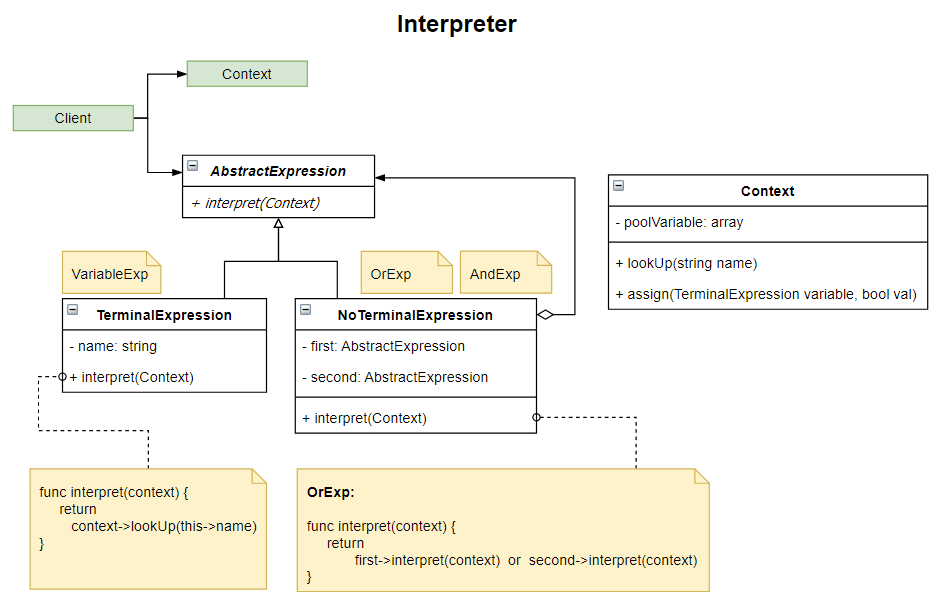

# Інтерпретатор (Interpreter)

## Призначення

Для деякої мови шаблон описує його граматику за допомогою термінів «Термінальний символ» та «Нетермінальний символ», 
а також описує інтерпретатор речень, створених за допомогою даної мови.

## Приклади

Інтерпретатор бінарної (двійкової) логіки, у якому кожен тип логічної операції визначено у своєму власному класі.

## Діаграма UML



## Код
Ви можете знайти цей код на [GitHub](https://github.com/PetroOstapuk/DesignPatternsPHP/tree/main/Behavioral/Interpreter)

```php title="AbstractExp.php"
<?php

declare(strict_types=1);

namespace DesignPatterns\Behavioral\Interpreter;

abstract class AbstractExp
{
    abstract public function interpret(Context $context): bool;
}
```

```php title="Context.php"
<?php

declare(strict_types=1);

namespace DesignPatterns\Behavioral\Interpreter;

use Exception;

class Context
{
    private array $poolVariable;

    public function lookUp(string $name): bool
    {
        if (!key_exists($name, $this->poolVariable)) {
            throw new Exception("no exist variable: $name");
        }

        return $this->poolVariable[$name];
    }

    public function assign(VariableExp $variable, bool $val)
    {
        $this->poolVariable[$variable->getName()] = $val;
    }
}
```

```php title="VariableExp.php"
<?php

declare(strict_types=1);

namespace DesignPatterns\Behavioral\Interpreter;

/**
 * This TerminalExpression
 */
class VariableExp extends AbstractExp
{
    public function __construct(private string $name)
    {
    }

    public function interpret(Context $context): bool
    {
        return $context->lookUp($this->name);
    }

    public function getName(): string
    {
        return $this->name;
    }
}
```

```php title="AndExp.php"
<?php

declare(strict_types=1);

namespace DesignPatterns\Behavioral\Interpreter;

/**
 * This NoTerminalExpression
 */
class AndExp extends AbstractExp
{
    public function __construct(private AbstractExp $first, private AbstractExp $second)
    {
    }

    public function interpret(Context $context): bool
    {
        return $this->first->interpret($context) && $this->second->interpret($context);
    }
}
```

```php title="OrExp.php"
<?php

declare(strict_types=1);

namespace DesignPatterns\Behavioral\Interpreter;

/**
 * This NoTerminalExpression
 */
class OrExp extends AbstractExp
{
    public function __construct(private AbstractExp $first, private AbstractExp $second)
    {
    }

    public function interpret(Context $context): bool
    {
        return $this->first->interpret($context) || $this->second->interpret($context);
    }
}
```

## Тест

```php title="Tests/InterpreterTest.php"
<?php

declare(strict_types=1);

namespace DesignPatterns\Behavioral\Interpreter\Tests;

use DesignPatterns\Behavioral\Interpreter\AndExp;
use DesignPatterns\Behavioral\Interpreter\Context;
use DesignPatterns\Behavioral\Interpreter\OrExp;
use DesignPatterns\Behavioral\Interpreter\VariableExp;
use PHPUnit\Framework\TestCase;

class InterpreterTest extends TestCase
{
    private Context $context;
    private VariableExp $a;
    private VariableExp $b;
    private VariableExp $c;

    public function setUp(): void
    {
        $this->context = new Context();
        $this->a = new VariableExp('A');
        $this->b = new VariableExp('B');
        $this->c = new VariableExp('C');
    }

    public function testOr()
    {
        $this->context->assign($this->a, false);
        $this->context->assign($this->b, false);
        $this->context->assign($this->c, true);

        // A ∨ B
        $exp1 = new OrExp($this->a, $this->b);
        $result1 = $exp1->interpret($this->context);

        $this->assertFalse($result1, 'A ∨ B must false');

        // $exp1 ∨ C
        $exp2 = new OrExp($exp1, $this->c);
        $result2 = $exp2->interpret($this->context);

        $this->assertTrue($result2, '(A ∨ B) ∨ C must true');
    }

    public function testAnd()
    {
        $this->context->assign($this->a, true);
        $this->context->assign($this->b, true);
        $this->context->assign($this->c, false);

        // A ∧ B
        $exp1 = new AndExp($this->a, $this->b);
        $result1 = $exp1->interpret($this->context);

        $this->assertTrue($result1, 'A ∧ B must true');

        // $exp1 ∧ C
        $exp2 = new AndExp($exp1, $this->c);
        $result2 = $exp2->interpret($this->context);

        $this->assertFalse($result2, '(A ∧ B) ∧ C must false');
    }
}
```