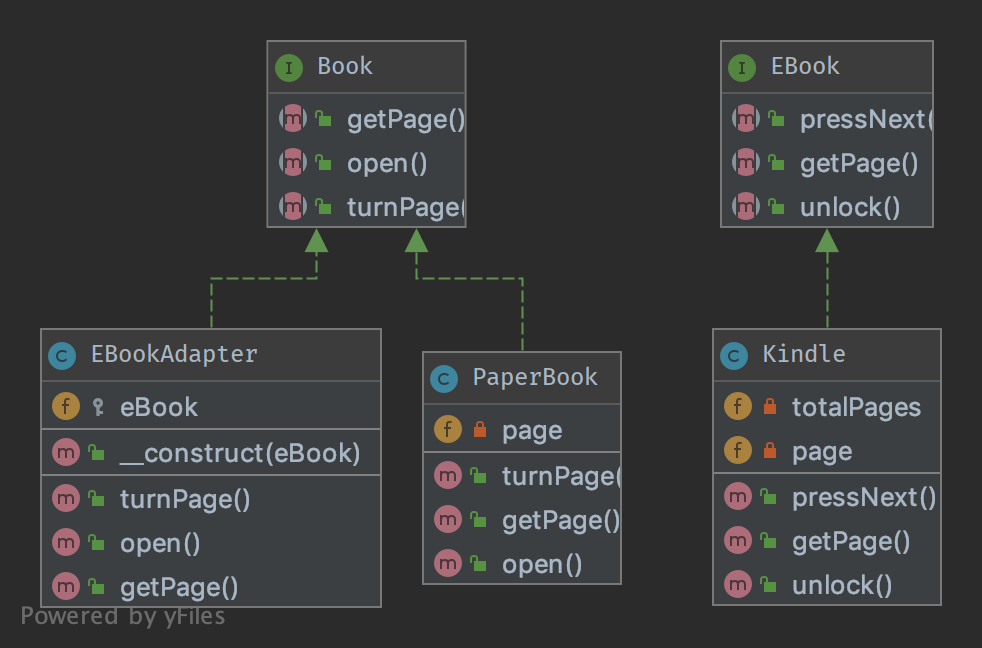

# Адаптер (Adapter / Wrapper)

## Призначення

Привести нестандартний або незручний інтерфейс якогось класу в інтерфейс, сумісний з вашим кодом. 
Адаптер дозволяє класам працювати разом стандартним чином, що зазвичай не виходить через несумісність інтерфейсів, 
надаючи для цього прошарок з інтерфейсом, зручним для клієнтів, самостійно використовуючи оригінальний інтерфейс.

## Приклади

Адаптер клієнтських бібліотек для роботи з базами даних.

Нормалізувати дані кількох різних вебсервісів, 
в однакову структуру, ніби ви працюєте зі стандартним сервісом


## Діаграма UML



## Код

Ви можете знайти цей код на [GitHub](https://github.com/PetroOstapuk/DesignPatternsPHP/tree/main/Structural/Adapter)

```php title="Book.php"
<?php

declare(strict_types=1);

namespace DesignPatterns\Structural\Adapter;

interface Book
{
    public function turnPage();

    public function open();

    public function getPage(): int;
}
```

```php title="PaperBook.php"
<?php

declare(strict_types=1);

namespace DesignPatterns\Structural\Adapter;

class PaperBook implements Book
{
    private int $page;

    public function open(): void
    {
        $this->page = 1;
    }

    public function turnPage(): void
    {
        $this->page++;
    }

    public function getPage(): int
    {
        return $this->page;
    }
}
```

```php title="EBook.php"
<?php

declare(strict_types=1);

namespace DesignPatterns\Structural\Adapter;

interface EBook
{
    public function unlock();

    public function pressNext();

    /**
     * returns current page and total number of pages, like [10, 100] is page 10 of 100
     *
     * @return int[]
     */
    public function getPage(): array;
}
```

```php title="EBookAdapter.php"
<?php

declare(strict_types=1);

namespace DesignPatterns\Structural\Adapter;

/**
 * This is the adapter here. Notice it implements Book,
 * therefore you don't have to change the code of the client which is using a Book
 */
class EBookAdapter implements Book
{
    public function __construct(protected EBook $eBook)
    {
    }

    /**
     * This class makes the proper translation from one interface to another.
     */
    public function open()
    {
        $this->eBook->unlock();
    }

    public function turnPage()
    {
        $this->eBook->pressNext();
    }

    /**
     * notice the adapted behavior here: EBook::getPage() will return two integers, but Book
     * supports only a current page getter, so we adapt the behavior here
     */
    public function getPage(): int
    {
        return $this->eBook->getPage()[0];
    }
}
```

```php title="Kindle.php"
<?php

declare(strict_types=1);

namespace DesignPatterns\Structural\Adapter;

/**
 * this is the adapted class. In production code, this could be a class from another package, some vendor code.
 * Notice that it uses another naming scheme and the implementation does something similar but in another way
 */
class Kindle implements EBook
{
    private int $page = 1;
    private int $totalPages = 100;

    public function pressNext()
    {
        $this->page++;
    }

    public function unlock()
    {
    }

    /**
     * returns current page and total number of pages, like [10, 100] is page 10 of 100
     *
     * @return int[]
     */
    public function getPage(): array
    {
        return [$this->page, $this->totalPages];
    }
}
```

## Тест

```php title="Tests/AdapterTest.php"
<?php

declare(strict_types=1);

namespace DesignPatterns\Structural\Adapter\Tests;

use DesignPatterns\Structural\Adapter\PaperBook;
use DesignPatterns\Structural\Adapter\EBookAdapter;
use DesignPatterns\Structural\Adapter\Kindle;
use PHPUnit\Framework\TestCase;

class AdapterTest extends TestCase
{
    public function testCanTurnPageOnBook()
    {
        $book = new PaperBook();
        $book->open();
        $book->turnPage();

        $this->assertSame(2, $book->getPage());
    }

    public function testCanTurnPageOnKindleLikeInANormalBook()
    {
        $kindle = new Kindle();
        $book = new EBookAdapter($kindle);

        $book->open();
        $book->turnPage();

        $this->assertSame(2, $book->getPage());
    }
}
```