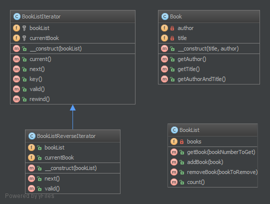

# Ітератор (Iterator)

## Призначення

Зробити об’єкт ітерованим, щоб він виглядав як колекція об'єктів.

## Приклади

Стрічковий перебір файлу, який представлений у вигляді об'єкта, що містить рядки, що теж є об'єктами. 
Оброблювач буде запущений поверх всіх об'єктів.

## Примітка

Стандартна бібліотека PHP SPL визначає інтерфейс Iterator, який добре підходить для цих цілей. Також вам може 
знадобитися реалізувати інтерфейс Countable, щоб дозволити викликати `count($object)` у вашому ітерованому об'єкті.

## Діаграма UML



## Код
Ви можете знайти цей код на [GitHub](https://github.com/PetroOstapuk/DesignPatternsPHP/tree/main/Behavioral/Iterator)

```php title="Book.php"
<?php

declare(strict_types=1);

namespace DesignPatterns\Behavioral\Iterator;

class Book
{
    public function __construct(private string $title, private string $author)
    {
    }

    public function getAuthor(): string
    {
        return $this->author;
    }

    public function getTitle(): string
    {
        return $this->title;
    }

    public function getAuthorAndTitle(): string
    {
        return $this->getTitle() . ' by ' . $this->getAuthor();
    }
}
```

```php title="BookList.php"
<?php

declare(strict_types=1);

namespace DesignPatterns\Behavioral\Iterator;

use Countable;
use Iterator;

class BookList implements Countable, Iterator
{
    /**
     * @var Book[]
     */
    private array $books = [];
    private int $currentIndex = 0;

    public function addBook(Book $book)
    {
        $this->books[] = $book;
    }

    public function removeBook(Book $bookToRemove)
    {
        foreach ($this->books as $key => $book) {
            if ($book->getAuthorAndTitle() === $bookToRemove->getAuthorAndTitle()) {
                unset($this->books[$key]);
            }
        }

        $this->books = array_values($this->books);
    }

    public function count(): int
    {
        return count($this->books);
    }

    public function current(): Book
    {
        return $this->books[$this->currentIndex];
    }

    public function key(): int
    {
        return $this->currentIndex;
    }

    public function next()
    {
        $this->currentIndex++;
    }

    public function rewind()
    {
        $this->currentIndex = 0;
    }

    public function valid(): bool
    {
        return isset($this->books[$this->currentIndex]);
    }
}
```

## Тест

```php title="Tests/IteratorTest.php"
<?php

declare(strict_types=1);

namespace DesignPatterns\Behavioral\Iterator\Tests;

use DesignPatterns\Behavioral\Iterator\Book;
use DesignPatterns\Behavioral\Iterator\BookList;
use PHPUnit\Framework\TestCase;

class IteratorTest extends TestCase
{
    public function testCanIterateOverBookList()
    {
        $bookList = new BookList();
        $bookList->addBook(new Book('Learning PHP Design Patterns', 'William Sanders'));
        $bookList->addBook(new Book('Professional Php Design Patterns', 'Aaron Saray'));
        $bookList->addBook(new Book('Clean Code', 'Robert C. Martin'));

        $books = [];

        foreach ($bookList as $book) {
            $books[] = $book->getAuthorAndTitle();
        }

        $this->assertSame(
            [
                'Learning PHP Design Patterns by William Sanders',
                'Professional Php Design Patterns by Aaron Saray',
                'Clean Code by Robert C. Martin',
            ],
            $books
        );
    }

    public function testCanIterateOverBookListAfterRemovingBook()
    {
        $book = new Book('Clean Code', 'Robert C. Martin');
        $book2 = new Book('Professional Php Design Patterns', 'Aaron Saray');

        $bookList = new BookList();
        $bookList->addBook($book);
        $bookList->addBook($book2);
        $bookList->removeBook($book);

        $books = [];
        foreach ($bookList as $book) {
            $books[] = $book->getAuthorAndTitle();
        }

        $this->assertSame(
            ['Professional Php Design Patterns by Aaron Saray'],
            $books
        );
    }

    public function testCanAddBookToList()
    {
        $book = new Book('Clean Code', 'Robert C. Martin');

        $bookList = new BookList();
        $bookList->addBook($book);

        $this->assertCount(1, $bookList);
    }

    public function testCanRemoveBookFromList()
    {
        $book = new Book('Clean Code', 'Robert C. Martin');

        $bookList = new BookList();
        $bookList->addBook($book);
        $bookList->removeBook($book);

        $this->assertCount(0, $bookList);
    }
}
```