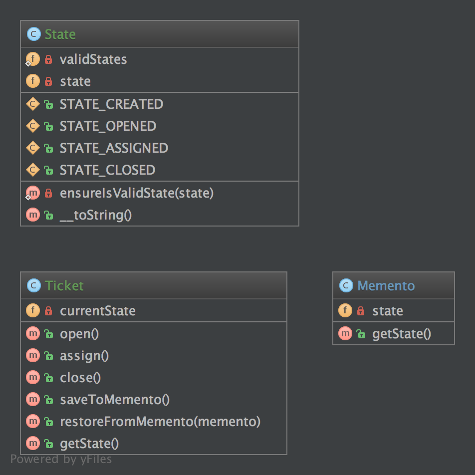

# 6. Знімок (Memento)

## Призначення

Патерн надає можливість відновити об'єкт у його попередньому стані (скасувати дію за допомогою відкату до 
попереднього стану) або отримати доступ до стану об'єкта, не розкриваючи його реалізацію (тобто. сам об'єкт не 
повинен мати функціональність для повернення поточного стану).

Шаблон Зберігач реалізується трьома об'єктами: «Творцем» (originator), «Опікуном» (caretaker) і «Охоронець» (memento).

Знімок - це об'єкт, який зберігає конкретний знімок стану деякого об'єкта чи ресурсу: рядки, числа, масиву, 
екземпляра класу і так далі. Унікальність у такому випадку має на увазі не заборону на існування однакових станів у 
різних знімках, а те, що стан можна витягти у вигляді незалежної копії. Будь-який об'єкт, що зберігається в 
Знімок повинен бути повною копією вихідного об'єкта, а не посиланням на вихідний об'єкт. Сам об'єкт Знімок є 
«непрозорим об'єктом» (той, який ніхто не може і не повинен змінювати).

Творець - це об'єкт, який містить у собі актуальний стан зовнішнього об'єкта строго заданого типу* і вміє створювати 
унікальну копію цього стану, повертаючи її, обгорнуту в об'єкт Знімок. Творець не знає історії змін. Творцю можна 
примусово встановити конкретний стан ззовні, яка буде вважатися актуальною. Творець повинен подбати про те, щоб цей 
стан відповідав типу об'єкта, з яким йому дозволено працювати. Творець може (але не зобов'язаний) мати будь-які методи,
але вони не можуть змінити збережений стан об'єкта.

Опікун керує історією знімків станів. Він може вносити зміни до об'єкта, приймати рішення про збереження стану 
зовнішнього об'єкта у Творці, вимагати від Творця знімок поточного стану, або привести стан Творця у відповідність до 
стану якогось знімка з історії.

## Приклади

Зерно генератора псевдовипадкових чисел.

Стан кінцевого автомата.

Контроль проміжних станів ORM моделі перед збереженням.

## Діаграма UML



## Код
Ви можете знайти цей код на [GitHub](https://github.com/PetroOstapuk/DesignPatternsPHP/tree/main/Behavioral/Memento)

```php title="Memento.php"
<?php

declare(strict_types=1);

namespace DesignPatterns\Behavioral\Memento;

class Memento
{
    public function __construct(private State $state)
    {
    }

    public function getState(): State
    {
        return $this->state;
    }
}
```

```php title="State.php"
<?php

declare(strict_types=1);

namespace DesignPatterns\Behavioral\Memento;

use InvalidArgumentException;

class State implements \Stringable
{
    public const STATE_CREATED = 'created';
    public const STATE_OPENED = 'opened';
    public const STATE_ASSIGNED = 'assigned';
    public const STATE_CLOSED = 'closed';

    private string $state;

    /**
     * @var string[]
     */
    private static array $validStates = [
        self::STATE_CREATED,
        self::STATE_OPENED,
        self::STATE_ASSIGNED,
        self::STATE_CLOSED,
    ];

    public function __construct(string $state)
    {
        self::ensureIsValidState($state);

        $this->state = $state;
    }

    private static function ensureIsValidState(string $state)
    {
        if (!in_array($state, self::$validStates)) {
            throw new InvalidArgumentException('Invalid state given');
        }
    }

    public function __toString(): string
    {
        return $this->state;
    }
}
```

```php title="Ticket.php"
<?php

declare(strict_types=1);

namespace DesignPatterns\Behavioral\Memento;

/**
 * Ticket is the "Originator" in this implementation
 */
class Ticket
{
    private State $currentState;

    public function __construct()
    {
        $this->currentState = new State(State::STATE_CREATED);
    }

    public function open()
    {
        $this->currentState = new State(State::STATE_OPENED);
    }

    public function assign()
    {
        $this->currentState = new State(State::STATE_ASSIGNED);
    }

    public function close()
    {
        $this->currentState = new State(State::STATE_CLOSED);
    }

    public function saveToMemento(): Memento
    {
        return new Memento(clone $this->currentState);
    }

    public function restoreFromMemento(Memento $memento)
    {
        $this->currentState = $memento->getState();
    }

    public function getState(): State
    {
        return $this->currentState;
    }
}
```

## Тест

```php title="Tests/MementoTest.php"
<?php

declare(strict_types=1);

namespace DesignPatterns\Behavioral\Memento\Tests;

use DesignPatterns\Behavioral\Memento\State;
use DesignPatterns\Behavioral\Memento\Ticket;
use PHPUnit\Framework\TestCase;

class MementoTest extends TestCase
{
    public function testOpenTicketAssignAndSetBackToOpen()
    {
        $ticket = new Ticket();

        // open the ticket
        $ticket->open();
        $openedState = $ticket->getState();
        $this->assertSame(State::STATE_OPENED, (string) $ticket->getState());

        $memento = $ticket->saveToMemento();

        // assign the ticket
        $ticket->assign();
        $this->assertSame(State::STATE_ASSIGNED, (string) $ticket->getState());

        // now restore to the opened state, but verify that the state object has been cloned for the memento
        $ticket->restoreFromMemento($memento);

        $this->assertSame(State::STATE_OPENED, (string) $ticket->getState());
        $this->assertNotSame($openedState, $ticket->getState());
    }
}
```