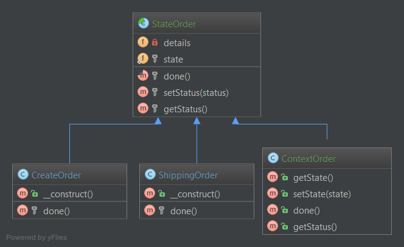

# 10. Стан (State)

## Призначення

Інкапсулює зміну поведінки тих самих методів залежно від стану об'єкта. Цей патерн допоможе витонченим способом змінити 
поведінку об'єкта під час виконання не вдаючись до великих умовних операторів.

## Діаграма UML



## Код
Ви можете знайти цей код на [GitHub](https://github.com/PetroOstapuk/DesignPatternsPHP/tree/main/Behavioral/State)

```php title="OrderContext.php"
<?php

declare(strict_types=1);

namespace DesignPatterns\Behavioral\State;

class OrderContext
{
    private State $state;

    public static function create(): OrderContext
    {
        $order = new self();
        $order->state = new StateCreated();

        return $order;
    }

    public function setState(State $state)
    {
        $this->state = $state;
    }

    public function proceedToNext()
    {
        $this->state->proceedToNext($this);
    }

    public function toString()
    {
        return $this->state->toString();
    }
}
```

```php title="State.php"
<?php

declare(strict_types=1);

namespace DesignPatterns\Behavioral\State;

interface State
{
    public function proceedToNext(OrderContext $context);

    public function toString(): string;
}
```

```php title="StateCreated.php"
<?php

declare(strict_types=1);

namespace DesignPatterns\Behavioral\State;

class StateCreated implements State
{
    public function proceedToNext(OrderContext $context)
    {
        $context->setState(new StateShipped());
    }

    public function toString(): string
    {
        return 'created';
    }
}
```

```php title="StateShipped.php"
<?php

declare(strict_types=1);

namespace DesignPatterns\Behavioral\State;

class StateShipped implements State
{
    public function proceedToNext(OrderContext $context)
    {
        $context->setState(new StateDone());
    }

    public function toString(): string
    {
        return 'shipped';
    }
}
```

```php title="StateDone.php"
<?php

declare(strict_types=1);

namespace DesignPatterns\Behavioral\State;

class StateDone implements State
{
    public function proceedToNext(OrderContext $context)
    {
        // there is nothing more to do
    }

    public function toString(): string
    {
        return 'done';
    }
}
```

## Тест

```php title="Tests/StateTest.php"
<?php

declare(strict_types=1);

namespace DesignPatterns\Behavioral\State\Tests;

use DesignPatterns\Behavioral\State\OrderContext;
use PHPUnit\Framework\TestCase;

class StateTest extends TestCase
{
    public function testIsCreatedWithStateCreated()
    {
        $orderContext = OrderContext::create();

        $this->assertSame('created', $orderContext->toString());
    }

    public function testCanProceedToStateShipped()
    {
        $contextOrder = OrderContext::create();
        $contextOrder->proceedToNext();

        $this->assertSame('shipped', $contextOrder->toString());
    }

    public function testCanProceedToStateDone()
    {
        $contextOrder = OrderContext::create();
        $contextOrder->proceedToNext();
        $contextOrder->proceedToNext();

        $this->assertSame('done', $contextOrder->toString());
    }

    public function testStateDoneIsTheLastPossibleState()
    {
        $contextOrder = OrderContext::create();
        $contextOrder->proceedToNext();
        $contextOrder->proceedToNext();
        $contextOrder->proceedToNext();

        $this->assertSame('done', $contextOrder->toString());
    }
}
```