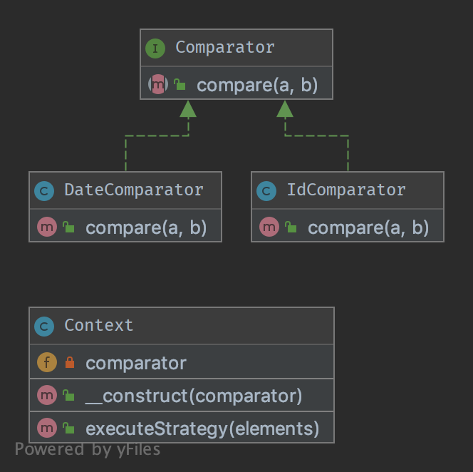

# Стратегія (Strategy)

## Термінологія

Контекст

Стратегія

Конкретна стратегія

## Призначення

Щоб розділити стратегії та отримати можливість швидкого перемикання між ними. Також цей патерн є гарною альтернативою 
успадкування (замість розширення абстрактного класу).

## Приклади

Сортування списку об'єктів, одна стратегія сортує за датою, інша за id.

Спростити Unit тестування: наприклад перемикання між файловим сховищем та сховищем в оперативній пам'яті.


## Діаграма UML



## Код
Ви можете знайти цей код на [GitHub](https://github.com/PetroOstapuk/DesignPatternsPHP/tree/main/Behavioral/Strategy)

```php title="Context.php"
<?php

declare(strict_types=1);

namespace DesignPatterns\Behavioral\Strategy;

class Context
{
    public function __construct(private Comparator $comparator)
    {
    }

    public function executeStrategy(array $elements): array
    {
        uasort($elements, [$this->comparator, 'compare']);

        return $elements;
    }
}
```

```php title="Comparator.php"
<?php

declare(strict_types=1);

namespace DesignPatterns\Behavioral\Strategy;

interface Comparator
{
    /**
     * @param mixed $a
     * @param mixed $b
     */
    public function compare($a, $b): int;
}
```

```php title="DateComparator.php"
<?php

declare(strict_types=1);

namespace DesignPatterns\Behavioral\Strategy;

use DateTime;

class DateComparator implements Comparator
{
    public function compare($a, $b): int
    {
        $aDate = new DateTime($a['date']);
        $bDate = new DateTime($b['date']);

        return $aDate <=> $bDate;
    }
}
```

```php title="IdComparator.php"
<?php

declare(strict_types=1);

namespace DesignPatterns\Behavioral\Strategy;

class IdComparator implements Comparator
{
    public function compare($a, $b): int
    {
        return $a['id'] <=> $b['id'];
    }
}
```

## Тест

```php title="Tests/StrategyTest.php"
<?php

declare(strict_types=1);

namespace DesignPatterns\Behavioral\Strategy\Tests;

use DesignPatterns\Behavioral\Strategy\Context;
use DesignPatterns\Behavioral\Strategy\DateComparator;
use DesignPatterns\Behavioral\Strategy\IdComparator;
use PHPUnit\Framework\TestCase;

class StrategyTest extends TestCase
{
    public function provideIntegers()
    {
        return [
            [
                [['id' => 2], ['id' => 1], ['id' => 3]],
                ['id' => 1],
            ],
            [
                [['id' => 3], ['id' => 2], ['id' => 1]],
                ['id' => 1],
            ],
        ];
    }

    public function provideDates()
    {
        return [
            [
                [['date' => '2014-03-03'], ['date' => '2015-03-02'], ['date' => '2013-03-01']],
                ['date' => '2013-03-01'],
            ],
            [
                [['date' => '2014-02-03'], ['date' => '2013-02-01'], ['date' => '2015-02-02']],
                ['date' => '2013-02-01'],
            ],
        ];
    }

    /**
     * @dataProvider provideIntegers
     *
     * @param array $collection
     * @param array $expected
     */
    public function testIdComparator($collection, $expected)
    {
        $obj = new Context(new IdComparator());
        $elements = $obj->executeStrategy($collection);

        $firstElement = array_shift($elements);
        $this->assertSame($expected, $firstElement);
    }

    /**
     * @dataProvider provideDates
     *
     * @param array $collection
     * @param array $expected
     */
    public function testDateComparator($collection, $expected)
    {
        $obj = new Context(new DateComparator());
        $elements = $obj->executeStrategy($collection);

        $firstElement = array_shift($elements);
        $this->assertSame($expected, $firstElement);
    }
}
```