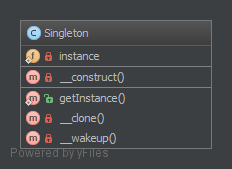

# 7. Одинак (Singleton)

**Це вважається антипатерном! Для кращої тестованості та супроводження коду використовуйте Ін'єкцію Залежності 
(Dependency Injection)!**

## Призначення

Дозволяє містити лише один екземпляр об'єкта в додатку, яке оброблятиме всі звернення, забороняючи створювати новий екземпляр.

## Приклади

DB Connector для підключення до бази даних

Logger

Блокування файлу в програмі (є лише один у файловій системі з одночасним доступом до нього)


## Діаграма UML



## Код
Ви можете знайти цей код на [GitHub](https://github.com/PetroOstapuk/DesignPatternsPHP/tree/main/Creational/Singleton)

```php title="Singleton.php"
<?php

declare(strict_types=1);

namespace DesignPatterns\Creational\Singleton;

use Exception;

final class Singleton
{
    private static ?Singleton $instance = null;

    /**
     * gets the instance via lazy initialization (created on first usage)
     */
    public static function getInstance(): Singleton
    {
        if (self::$instance === null) {
            self::$instance = new self();
        }

        return self::$instance;
    }

    /**
     * is not allowed to call from outside to prevent from creating multiple instances,
     * to use the singleton, you have to obtain the instance from Singleton::getInstance() instead
     */
    private function __construct()
    {
    }

    /**
     * prevent the instance from being cloned (which would create a second instance of it)
     */
    private function __clone()
    {
    }

    /**
     * prevent from being unserialized (which would create a second instance of it)
     */
    public function __wakeup()
    {
        throw new Exception("Cannot unserialize singleton");
    }
}
```

## Тест

```php title="Tests/SingletonTest.php"
<?php

declare(strict_types=1);

namespace DesignPatterns\Creational\Singleton\Tests;

use DesignPatterns\Creational\Singleton\Singleton;
use PHPUnit\Framework\TestCase;

class SingletonTest extends TestCase
{
    public function testUniqueness()
    {
        $firstCall = Singleton::getInstance();
        $secondCall = Singleton::getInstance();

        $this->assertInstanceOf(Singleton::class, $firstCall);
        $this->assertSame($firstCall, $secondCall);
    }
}
```