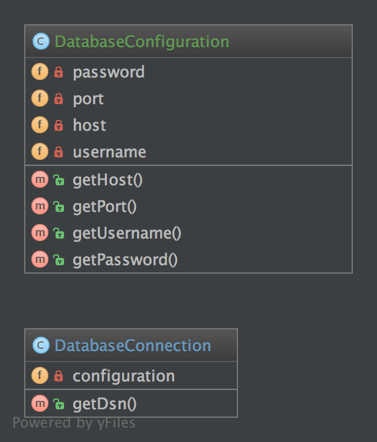

# 6. Впровадження залежності (Dependency Injection)

## Призначення

Для реалізації слабозв'язаної архітектури. Щоб отримати більше тестований код, що супроводжується та розширюється.

## Використання

Об’єкт `DatabaseConfiguration` впроваджується в `DatabaseConnection` і останній отримує все, що йому необхідно 
зі змінної `$config`. Без DI, конфігурація буде створена безпосередньо в `Connection`, що не дуже добре для 
тестування та розширення `Connection`, тому що пов'язує ці класи безпосередньо.

## Приклади

The Doctrine2 ORM використовує Впровадження Залежності, наприклад для конфігурації, яка впроваджується в об’єкт
`Connection`. Для цілей тестування, можна легко створити мок об'єкта конфігурації та впровадити його в об’єкт 
`Connection`, підмінивши оригінальний.

У багатьох фреймворках вже є контейнери для DI, які створюють об'єкти через масив з конфігурацією та впроваджують
туди, де це потрібно (наприклад у Контролери).


## Діаграма UML



## Код

Ви можете знайти цей код на [GitHub](https://github.com/PetroOstapuk/DesignPatternsPHP/tree/main/Structural/DependencyInjection)

```php title="DatabaseConfiguration.php"
<?php

declare(strict_types=1);

namespace DesignPatterns\Structural\DependencyInjection;

class DatabaseConfiguration
{
    public function __construct(
        private string $host,
        private int $port,
        private string $username,
        private string $password
    ) {
    }

    public function getHost(): string
    {
        return $this->host;
    }

    public function getPort(): int
    {
        return $this->port;
    }

    public function getUsername(): string
    {
        return $this->username;
    }

    public function getPassword(): string
    {
        return $this->password;
    }
}
```

```php title="DatabaseConnection.php"
<?php

declare(strict_types=1);

namespace DesignPatterns\Structural\DependencyInjection;

class DatabaseConnection
{
    public function __construct(private DatabaseConfiguration $configuration)
    {
    }

    public function getDsn(): string
    {
        // this is just for the sake of demonstration, not a real DSN
        // notice that only the injected config is used here, so there is
        // a real separation of concerns here

        return sprintf(
            '%s:%s@%s:%d',
            $this->configuration->getUsername(),
            $this->configuration->getPassword(),
            $this->configuration->getHost(),
            $this->configuration->getPort()
        );
    }
}
```

## Тест

```php title="Tests/DependencyInjectionTest.php"
<?php

declare(strict_types=1);

namespace DesignPatterns\Structural\DependencyInjection\Tests;

use DesignPatterns\Structural\DependencyInjection\DatabaseConfiguration;
use DesignPatterns\Structural\DependencyInjection\DatabaseConnection;
use PHPUnit\Framework\TestCase;

class DependencyInjectionTest extends TestCase
{
    public function testDependencyInjection()
    {
        $config = new DatabaseConfiguration('localhost', 3306, 'domnikl', '1234');
        $connection = new DatabaseConnection($config);

        $this->assertSame('domnikl:1234@localhost:3306', $connection->getDsn());
    }
}
```